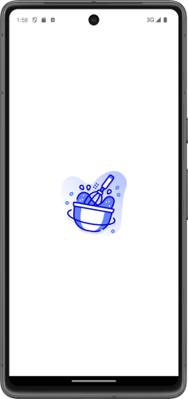
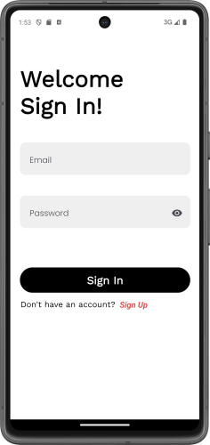
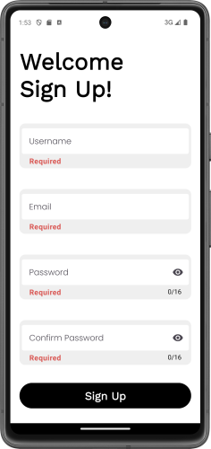
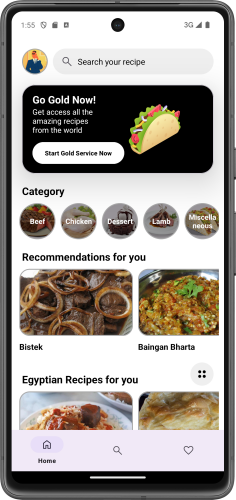
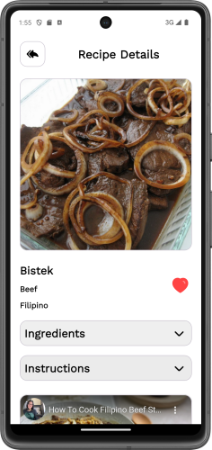
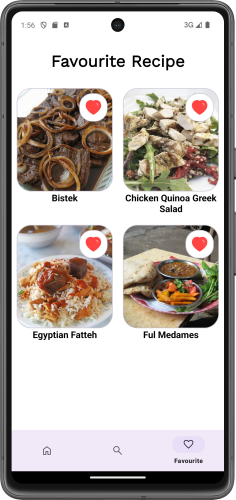
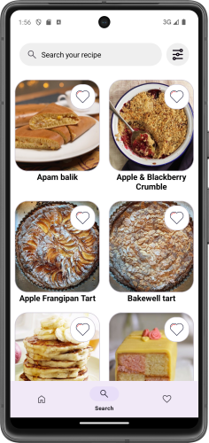

# Recipe App

  

Creating a complete recipe application that allows users to explore, search, and save their favorite recipes, with additional features such as video playback and user authentication.

## Table of Contents
- [Introduction](#introduction)
- [Features](#features)
- [Usage](#usage)
- [Screens](#screens)
- [Database](#database)
- [Navigation](#navigation)
- [Configuration](#configuration)

## Introduction
The Recipe App is designed to provide a seamless cooking experience, allowing users to search for recipes, view details, watch recipe-related videos, and save their favorites. The app includes multiple fragments for user authentication, recipe exploration, and user profile management, with an easy-to-use bottom navigation bar.

## Features
- **Splash Screen:** A splash screen using the Lottie library for animation.
- **User Authentication:** Login and registration screens to manage user sessions.
- **Recipe Search:** Search for recipes from [TheMealDB API](https://www.themealdb.com/api.php).
- **Favorites:** Save and manage your favorite recipes.
- **Video Playback:** Overlay video player for YouTube-like recipe videos.
- **Fragment Navigation:** Smooth navigation between different app sections using a Bottom Navigation component.
- **About Page:** Information about the app creator and app synopsis.

## Usage
1. Upon launching the app, the **Splash Screen** will appear.
2. New users must register or log in.
3. Once logged in, users will be directed to the **Home Fragment** where they can explore recipes.
4. Use the **Bottom Navigation** to switch between the **Home**, **Favorites**, and **Search** screens.
5. Click on a recipe to view details in the **RecipeDetailFragment**.
6. Save a recipe to favorites by clicking the "Save to Favorites" button.
7. Watch video instructions on recipes using the integrated video player.

## Screens
1. **SplashFragment**
   - Displays the animated splash screen for a few seconds.
   - 

2. **SignInFragment & SignUpFragment**
   - Handle user signing in and registration.
   - 
   - 

3. **HomeFragment**
   - Lists recipes fetched from the API.
   - 

4. **RecipeDetailFragment**
   - Displays recipe details, including image, ingredients, instructions and video.
   - 

5. **FavouriteFragment**
   - Shows a list of user's favorite recipes.
   - 

6. **SearchFragment**
   - Enables searching for recipes by name, category or keyword.
   - 

## Database
- **Local Database:** Room database is used to store all the data about the user.
- **Database Operations:** Handle save, update, delete, and fetch operations for Registration, Login and favorites.

## Navigation
- **AuthActivity:** Manages the **SplashFragment**, **LoginFragment**, and **RegisterFragment**.
- **RecipeActivity:** Manages the remaining fragments, allowing navigation through the Bottom Navigation.
- **Bottom Navigation:** Includes tabs for Home, Search, and Favorites, facilitating easy access to all features.

## Configuration
- **Shared Preferences:** Used to store user login status and track whether the user has logged in before.
- **API Configuration:** Integrate TheMealDB API for fetching recipes.
